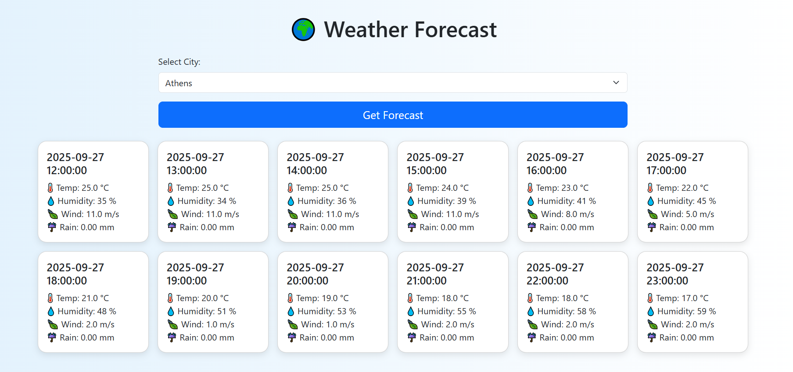

## 🌍 Weather Forecasting
This project is a full-stack weather forecasting dashboard built with Flask (Python backend) and a simple Bootstrap + Vanilla JS frontend.

It fetches weather data from the Open-Meteo API, processes it, applies time-series forecasting models, and serves predictions via a REST API. The frontend displays the forecasts in a clean, responsive dashboard.

Features:

* 📡 Fetch real-time & historical weather data from Open-Meteo.

* 🔄 Preprocessing pipeline to clean and prepare time series data.

* 🤖 Forecasting with seasonal models (temperature, humidity, wind speed, and rain).

* ⚡ REST API built with Flask to serve predictions per city.

* 🖥 Frontend dashboard with Bootstrap for clean UI:

* ✅ Unit tests with mocks (no real API calls).


### 🚀 How to Run the App
1️⃣ Clone the Repository
2️⃣ Set Up Python Environment

It’s recommended to use a virtual environment.
Install the dependencies:
```pip install -r requirements.txt```

3️⃣ Run the Backend (Flask API)

From the project root run:

```python -m src.app```

Flask should start at:

http://127.0.0.1:5000


Example API Endpoints:

* GET / → Health check.

* GET /cities → List available cities.

* GET /forecast?city=Athens&steps=12 → Forecast next 12 hours for Athens.

4️⃣ Run the Frontend

Navigate to frontend/ and open index.html in your browser by running:

```python -m http.server 8000```

Frontend will run on:
http://localhost:8000/index.html

The dashboard after choosing to make predictions for Athens will look like this:



👨‍💻 Author
Built with a lot of patience and learning step by step.